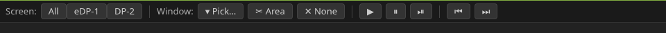

# spicetab

Read-only desktop viewer — serves your current X desktop in a browser via x11vnc + noVNC.

## Usage

```
make
```

This handles the Python venv, dependencies, downloading noVNC, launching x11vnc + websockify + an HTTP server, and opening a browser tab. All ports are picked automatically.

## Features

- **Live desktop view** — streams your `$DISPLAY` to any browser, read-only
- **Multi-monitor support** — toolbar buttons to switch between individual monitors or view all at once
- **Window picker** — dropdown listing visible windows; select one to clip the view to just that window
- **Area select** — click-drag to select an arbitrary screen region (requires `slop`)
- **Media controls** — play/pause/previous/next buttons controlling `playerctl`
- **Auto-exit** — shuts down automatically after 5 minutes with no connected browser
- **Auto-reload** — edit `serve.py` and the server restarts in-place without dropping the VNC connection
- **Connection notifications** — desktop notification when a new client IP connects

## Requirements

- [uv](https://docs.astral.sh/uv/) (Python package manager)
- `x11vnc`
- `xrandr`, `wmctrl`, `xwininfo` (for multi-monitor and window picker)
- `slop` (for area select)
- `playerctl` (for media controls)
- `notify-send` (for connection notifications)

Python dependencies (`websockify`) and noVNC are fetched automatically on first run.


